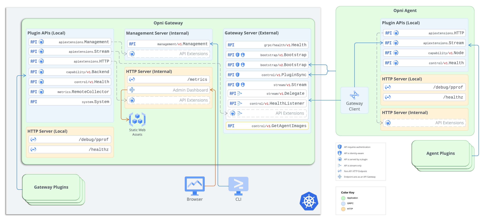
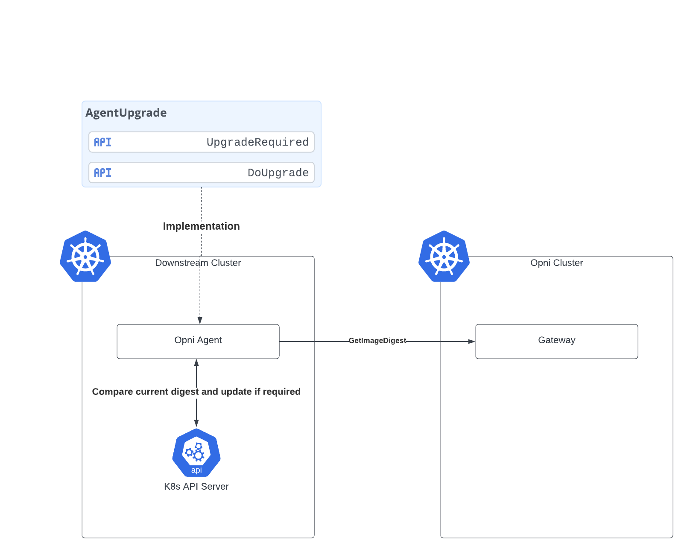

# Automatic updates of agent controllers

## Summary: 
Currently when the agent connects to a gateway there is a handshake and update of the plugins. However this does not address the case where either the agent itself needs to be updated, or the controllers that interact with agent custom resources and there CRDs need to be updated. The plugin update mechanism is also opaque to users; they may find it difficult to track what clusters have been updated in larger installs.

Instead we should use OCI images as immutable objects to update the agent components.  This would work similarly to how Rancher agents are updated; the deployment spec is updated which will result in an updated rollout.

## Use case: 
This would impact updating Opni.  Currently if there are changes to the controllers users are expected to manually update the CRDs and agent (using a helm chart) in each downstream cluster.  To improve the usability this should be automated.

Likewise when we update the agent (for example v0.9.0 had agent changes) it should be updated.

## Benefits: 
* Significantly reduce the burden to upgrading Opni, particularlly in large deployments
* Reduce the scope for contract mismatches between the agent and the gateway
* Increase the discoverabilty of agent upgrades and allow limited self servicing

## Impact: 
* There will be a new negotiation upon startup, along with a regular sync to confirm the image digests match
* Applying a manifest update may introduce a point of failure, but this can be mitigated.

## Implementation details: 
CRDs for the controller will be embedded in the binary.  These will be loaded when the controller first starts, mirroring how Wrangler manages CRDs.

A gRPC service will be created with a single funcion - `GetAgentImages`.  This will return the OCI image path to pull for the agent and the controller (2 separate pieces of data).  For this change we will retain the plugin sync mechanism for ensuring the plugin versions are identical.

*Image path calculation*
The gateway CRD will incude an option to set the OCI repo.  If this is not configured the repo that the gateway image is using will be the default.  Likewise there will be an option for the image tag.  If this is not provided the version will be used as a default.

The upgrade will be defined as an interface with two functions `UpgradeRequired` and `DoUpgrade`.  The initial implementation will be for Kubernetes and will check the existing digests and if required update the deployment spec.  This will result in a new pod being rolled out.

## Acceptance criteria: 
- [ ] Agent controller applies required CRDs to cluster
- [ ] When agent connects to gateway it performs an upgrade check
- [ ] Agent upgrades itself and controller when required.
- [ ] Unit tests for upgrade process

## Supporting documents: 
Added gateway API function

Agent Upgrade implementation

## Dependencies: 
N/A

## Risks and contingencies: 
Redeploying the agent introduces a point of failure, and could potentially deadlock.  However there should be prior art in Rancher Manager as this is this is similar to the upgrade process they use so we can lean on their experience to mitigate this.

## Level of Effort: 
4 days - Controller CRDs
7 days - Upgrade process
4 days - Manual testing

## Resources: 
N/A
