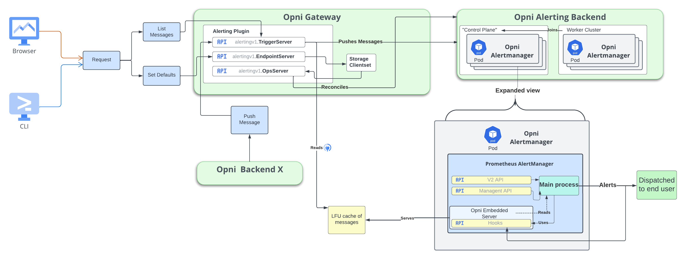

# Title:

Alerting Cluster as a Plain Messaging System

## Summary:

Opni Alerting plugin only evaluates and sends alarms. The Opni-Alerting cluster should send messages from other Opni backends to endpoints of the User's choice.

## Use case:

- Opni backends, for example, AiOps require a way to send `Plain` messages to the end user.
- Users want to set default endpoints to receive notifications on
- Users should have a way to see received messages even if they have no endpoints configured

## Benefits:

- Allows any service in the opni ecosystem to send pertinent messages to users
- Provide a way to set default endpoints on messages generated by Opni-Alerting
- Always persist a small amount of the most important messages generated, for end-user UX

## Impact:

## Implementation details:



- For setting default endpoints, the alerting storage client set will be responsible for marking the desired defaults via the endpoints server
- For applying the default endpoints to the Alerting Cluster, the reconciler will build them into the routing data model.
- The trigger server will be responsible for pushing `Plain` messages from external sources to the end user in the following format:

```proto
service AlertTriggers {
  //...
  rpc PushMessage(PlainMessage) returns (google.protobuf.Empty) {}
  //...
}

message PlainMessage {
  // required : title of the message
  string title = 1;
  // required : (HTML renderable) body of the message
  string body = 2;
  // optional, defaults to info
  alerting.OpniSeverity severity = 3;
  // optional rate limiting key set by the caller
  string key = 4;
}

```

- The default.opni.hook in the opni routing data model, will persist incoming `Plain` and `Alarm` messages into small LFU caches
- The embedded server will serve those LFU caches back to the trigger server via a ListMessages API

### UI

- Right Click set as default on endpoints on the AlertEndpoint page
- Display two lists, for example of 25 maximum each, of structured messages (`Plain` / `Alarm`) that can contain HTML

## Acceptance criteria:

- [ ] Gateway push message API, consumable by Opni backends
- [ ] Setting a set of Default Endpoints
- [ ] A small in memory priority LFU cache based on severity to store `Alarm` messages
- [ ] A small in memory priority LFU cache based on severity to store `Plain` messages
- [ ] Gateway API to read messages stored in cache

## Supporting documents:

## Dependencies:

- Opni Router interface : https://github.com/rancher/opni/pull/942

## Risks and contingencies:

| Risk                                                               | Contingency                                                                                 |
| ------------------------------------------------------------------ | ------------------------------------------------------------------------------------------- |
| Breaking change to the AlertEndpoint protocol buffer specification | Use the existing Alerting Storage ClientSet migration mechanism to migrate breaking changes |

## Level of Effort:

1 week

- 1 day : push message API
- 1 day : setting default endpoints
- 2 days : (distributed) priority LFU caches
- 1 day : Gateway API to read messages stored in caches

## Resources:

1 Opni Upstream Cluster
