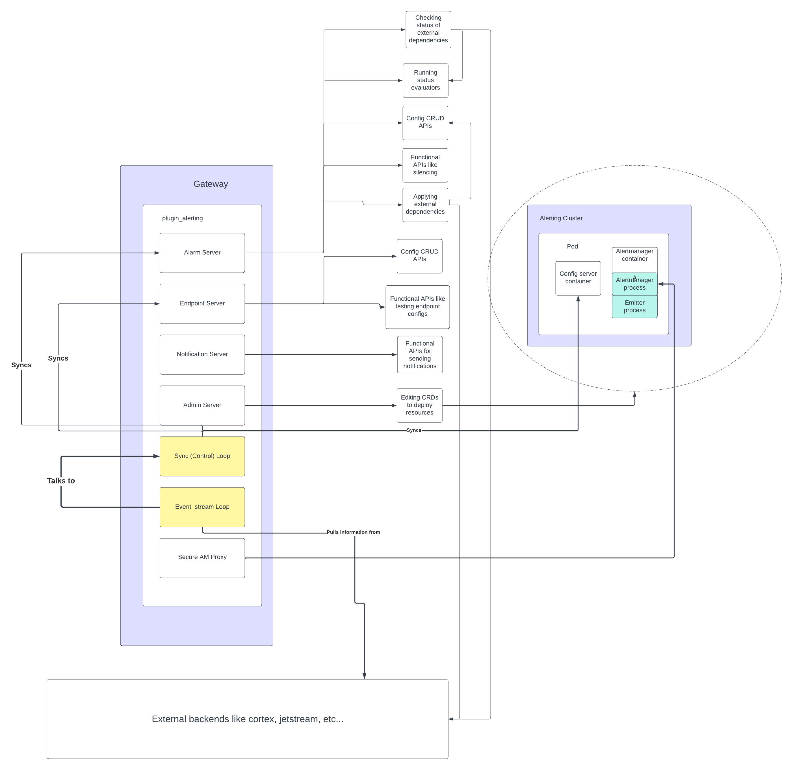
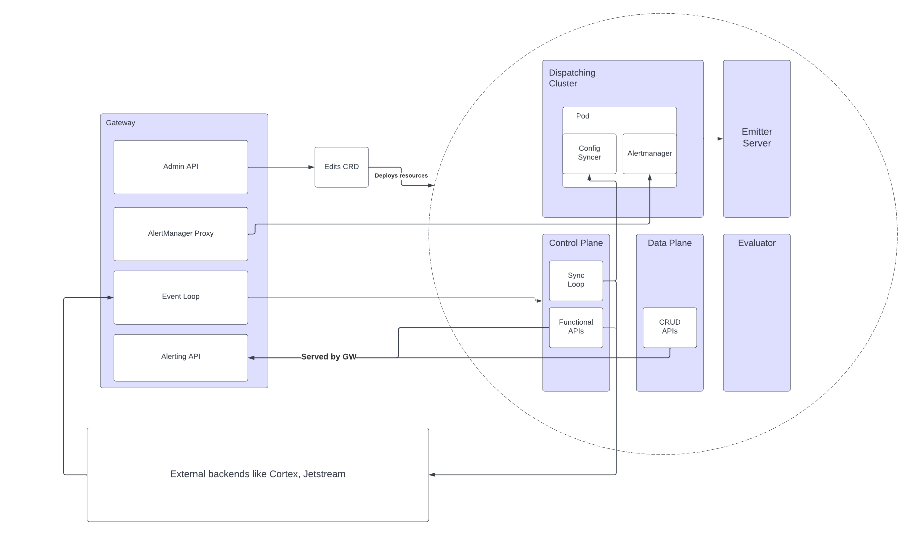

# Title

Opni Alerting into a Microservice architecture

## Summary :

Opni Alerting requires functionality that is outside the scope of a gateway plugin, which should only be
responsible for forwarding requests to their destination.

## Usecase :

- High availabiility & scaling of opni alerting
  - each (functional) component of alerting has different requirements for maintaining consistency & availability
- Required for high availability & scaling of opni gateway

## Benefits :

- Easier to manage scalability of alerting components
- Greatly reduces complexity of opni gateway responsibility
- Failure recovery for individual components
- Easier to test & manage growing alerting features

## Impact :

- Addresses production usecases of alerting

## Implementation details

Currently the opni alerting architecture looks like the gateway monolith in the supporting documents.

The subcomponents of each system are functionaly separate but are part of the same lifecycle
as the gateway (or the alertmanager cluster, for the config reconciler & emitters).

The components in yellow specifically belong outside the scope of the gateway since they should be able to track stateful information and operate outside of the gateway's lifecycle.

In this proposal, we want to separate the gateway alerting plugin into separate services

- CRUD configs
- functional APIs & syncing configs
- Dispatching alerts
- Evaluating internal status
- Emitting alerts to a default place (cache/ kubernetes events).

In essence, each subcomponent is separated out to scale independently and recover from potential failures independently.

## Acceptance criteria

Separating the existing apis into the following separate services:

- [ ] A **control plane** deployment, that manages the "sync tasks" of the alerting plugin.
  - [ ] Applies/removes alerting configurations on their respective backend
  - [ ] Builds the AM configuration required to route alerts to their respective endpoints
  - [ ] Applies functional apis to their respective backends, like silencing endpoints and sending notifications to endpoints
  - [ ] Its APIs will be served by the Gateway
  - This can scale according to a leader election process
- [ ] A **data plane** deployment, that manages persisting the opni alerting configurations.
  - [ ] Stores alerting endpoints / conditions / SLOs
  - [ ] Its APIs will be served by the Gateway
  - This can scale according to a distributed locking mechanism
- [ ] An **evaluator** deployment, which takes on the role of tracking the the state of internal opni components for alerting on things that are mission critical for opni
  - [ ] evaluates status of agents / opni backends over time
  - [ ] send alerts based on loaded user configs that track opni status
  - This can scale via a leader election process
- [ ] Emitter deployment
  - Handles sending all received notifications to a backend such as:
    - [ ] Alerting message cache
    - [ ] Kubernetes events API
  - In the future, sending messages to OpenSearch
  - can scale according to builtin k8s service LB, it is completely stateless

## Supporting documents

### Gateway monolith

### Microservice

### Dependencies

- Downstream Agent : https://github.com/rancher/opni/pull/1493
- HA consistency : https://github.com/rancher/opni/pull/1408

## Risks and Contigencies

N/A

## Level of Effort

2 weeks

- 1 week separating servers into opni commands + pods
- 1 week testing

## Resources

- 1 Upstream and 1 Downstream alerting cluster
