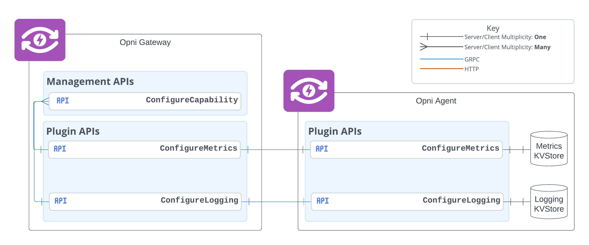

# Title: Customize Capability Install

## Summary:
When installing capabilities to agent's, Opni should allow for users to configure some capability options such as specifying node drivers and enabling / disabling capability features. This would make Opni agent's more adaptable to environments which might break some functionality or require fine-tuning for Opni to work as expected.

## Use case:
When installing the Metrics plugin on a cluster which has an existing [`kube-prometheus-stack`](https://github.com/prometheus-community/helm-charts/tree/main/charts/kube-prometheus-stack) deployment, the current `externalPromDriver` will break the existing infrastructure. To resolve this, the user should be able to specify a different node driver to use while the existing infrastructure is still in use.

## Benefits:
 * Add more configuration options to plugins
 * Could help move some configurations from Helm values making the Opni install process simpler

## Impact:
There should be no impact on existing systems, since this enhancement is purely additive.

## Implementation details:
For each plugin that needs to support capability configuration, a `Confiure<CapabilityName>` service which will specify the allowed configuration options, receive them from the gateway, and store them in a `KVStore`. When installing a capability, the plugin will pull from that `KVStore` to decide  what resources it needs create, what drivers to use, etc. Users can access these endpoints with `opni capability configure <cluster> <name> [<options>...]`.

For example, to enable the user to choose from several node drivers when installing the metrics capability:

```protobuf
syntax = "proto3";
option go_package = "github.com/rancher/opni/plugins/metrics/pkg/apis/remoteread";

import "google/protobuf/empty.proto";

service ConfigureMetrics {
  rpc Configure(MetricsOptions) returns (google.protobuf.Empty);
}

enum NodeDriver {
  Unknown = 0;
  None = 1;
  ExternalPromDriver = 2;
}

message MetricsOptions {
  NodeDriver nodeDriver = 1;
}
```

And to configure the metrics node driver, the user can run: `opni capabilities configure 0194fdc2-fa2f-4cc0-81d3-ff12045b73c8 metrics --driver ExternalPrometheusDriver`

## Acceptance criteria:
- [ ] The user can pass configuration options to plugins
- [ ] Plugins can retrieve options when installing a capability
- [ ] User should be able to change and apply new options
- [ ] The user should be able to view the options for a capability 

## Supporting documents:



[//]: # (## Dependencies: )

[//]: # (## Risks and contingencies:)

## Level of Effort
Should take 2 days for implementation and testing.
LOE: 2

## Resources:
This feature won't significantly increase Opni resource usage. This will add N + 1 services (where N is the number of plugins) at most to the system along with the extra storage required for the options.