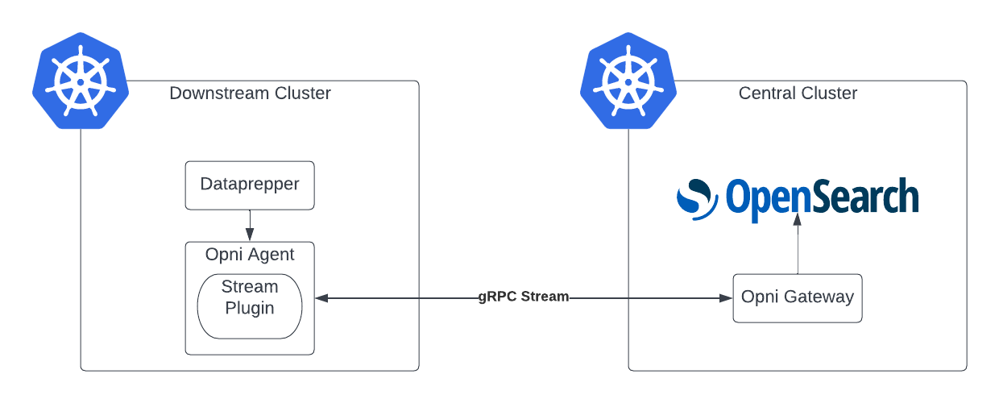

# Proxy Opensearch over gRPC

## Summary: 
Currently we require the user to expose the Opensearch API in the central cluster, and the data prepper connects directly to this to ship logs.  Instead we should proxy the Opensearch API over gRPC and have the data prepper write the logs to the agent which will then transport them to the Opensearch API.

## Use case: 
This would replace all current direct interaction with Opensearch from a dowmstream cluster.

## Benefits: 
Security - no longer need to transfer username and password to the downstream cluster. Authentication will be completed using the current agent ECDH mechanism.
Simplicity - users will no longer need to manually set up Opensearch to be available to the outside world, and won't need to configure this in the Logging backend
Consisteny - will be a similar mechanism to monitoring. It also means if the agent disconnects we will have a cleaner mechanism of stopping log shipping.

## Impact: 
The change will largely be transparent to end users.

Potential drawbacks are as follows:
Resilience - agent becomes a critical single point of failure (although this is arguably already the case)
Performance - a transparent proxy should not involve any signficant performance issues, however it is more data running through the agent which will have an impact.

## Implementation details: 
For the downstream cluster a new streaming extension with an http interface will be created. Queries received on the http will be proxied over gRPC to the Gateway. The gateway will forward the query to Opensearch and return the response.

The gateway will have a dedicated extension for forwarding the communication to Opensearch.  Authentication to Opensearch will be with a dedicated user and use mTLS auth.

## Acceptance criteria: 
 * Logs successfully transported over gRPC and visible in Opensearch
 * Opensearch external URL configuration elements removed
 * Documentation updated to remove requirements for external Opensearch

## Supporting documents: 
N/A

## Dependencies: 
None; all dependencies have been completed.

## Risks and contingencies: 
| Risk | Contingency|
|---|---|
| Shipping logs over gRPC causes significant performance issues in either Agent or Gateway | Investigate alternatives using compression or refactor of the proxy process, could also tune the gRPC connection settings.  Additional scaling may be required|

## Level of Effort: 
3 days development
2 days automated test configuration
2 days manaul testing

## Resources: 
N/A
