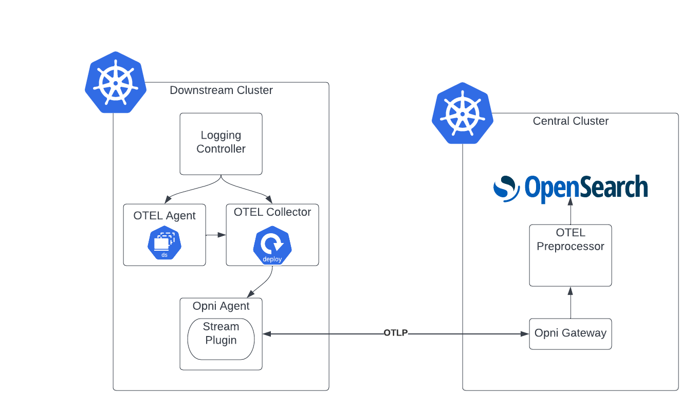

# Use OTEL for logging

## Status
 - [x] Pending
 - [ ] Completed
 - [ ] Superceded/Deprecated

## Summary: 
Currently logs are collected by fluentbit, sent to fluentd, sent to data prepper, then finally sent to Opensearch where preprocessing is done in an ingest pipeline.  I propose that we collect the logs using OTEL collector as an agent and then sent to a local OTEL collector.  The logs will then be sent through the agent using the OTLP and forwarded to a central pipeline for preprocessing.

## Use case: 
This will simplify the logging pipeline and allow use to consolidate on using OTEL collector for multiple verticles

## Benefits: 
* Improve maintainbilty my moving preprocessing out of an internal java project to a separate service
* Simplify sending logs via the Agent as OTLP is a gRPC format
* Align with the Open Telemetry project for logging
* We don't expose the Opensearch API outside of the central cluster so we never have to transmit credentials, or worry about escalated access to the API.

## Impact: 
* Remove dependence on the Banzaicloud operator. Fluentbit and Fluentd would be removed. However this means we will need to build our own log aggregation controller.
* This also means we will diverge from rancher-logging in its current form.
* We will need a migration path to deprecate the ingest plugin.

## Implementation details:
We will create a new Opensearch exporter for OTEL collector (it currently only has Elasticsearch which due to the version won't work with Opensearch).

We will import [plogotlp](https://github.com/open-telemetry/opentelemetry-collector/tree/main/pdata/plog/plogotlp) in to the gateway and agent plugins. This will allow us to create a streaming connection that forwards the gRPC messages from the agent to the gateway and from the gateway to the central preprocessor.

We will create a new kubernetes controller to be deployed with the Agent. This will create the OTEL logging configuration, replacing the LogAdapter CRD and controller that we currently use. We will also have a new controller running in the central cluster that is reponsible for configuring the preprocessing service.  There will be two CRDs that are serviced by this controller. This will allow us to have separate logging configuration for AIOps and pure Logging.

The new preprocessing service will authenticate to Opensearch using client certs.  It will use an account that has write only permissions.



The controller will be controlled by multiple CRDs.  The main one will be a `core.opni.io.collectors`.  This will be a collection of enabled collectors.  Each collector will have a field that is a reference to a specific CRD for collector specific configuration.  The logging config will be `logging.opni.io.collectorconfigs`.  This schema is extensible so more collectors (e.g. metrics) can be added as we move things to use the OTEL collector.

e.g
```yaml
---
apiVersion: core.opni.io/v1beta1
kind: Collector
metadata:
  name: agent-collector
  namespace: opni
spec:
  logging:
    name: logging-config
  metrics: {}
---
apiVersion: logging.opni.io/v1beta1
kind: CollectorConfig
metadata:
  name: logging-collector
  namespace: opni
spec:
  # Spec will contain logging specific configuration items.
```

**Migration**
Ingest plugin will be updated to skip processing if the `opni-collector` field exists on the log and is equal to `otel`. The OTEL preprocessing service will add this field to the log documents.  This will allow us to deprecate the ingest plugin and remove it in a later release.

For downstream cluster migrations this will be transparent to the user.  When the logging plugin runs a sync operation it will detect if the LogAdapter resource exists and if so delete it and then create the appropriate OTEL resources.

## Acceptance criteria: 
* Ingest plugin logic updated to skip processing if the `opni-collector` field exists on the log and is equal to `otel`
* OTLP Server/Client architecture registered in Logging plugins
* OTLP messages able to be forwarded over Gateway stream
* New Agent controller generates log scraping services
* Agent sync creates new custom resources
* Agent sycn deletes old custom resources if they exist
* New central cluster controller generates preprocessing configuration
* Log messages are scraped and end up in Opensearch

## Supporting documents: 
* [Example scrape configuration](https://gist.github.com/sumo-drosiek/c7b9d812cc3279062b0fe74e13aea64e).  I have eyeballed this and compared against the Kubernetes container log files, and the existing fluentbit configuration to confirm it is fit for purpose.

## Dependencies: 
We will need an Opensearch exporter for OTEL collector as the existing Elasticsearch one won't work with Opensearch

## Risks and contingencies: 
| **Risk** | **Contingency** |
|----------|-----------------|
| Open Telemetry may not accept the new exporter in a timely fashion | We will need to maintain a separate repository for the exporter and build a custom image for OTEL collector |
| Streaming logs over gRPC may introduce performance issues in the Gateway | We can review the gRPC connection settings, along with looking at scaling the Gateway.  However the risk of this should be minimal |
| Logging functions for OTEL are predominantly in Alpha | We may need to contribute upstream changes to stabilize this, however this is also an opportunity to work with the Open Telemetry community |

## Level of Effort: 
* Create Opensearch exporter - 2 days
* Forward OTLP over the Agent/Gateway - 5 days
* Create Kubernetes controller - 5 days
* E2E testing - 3 days

## Resources: 
N/A
