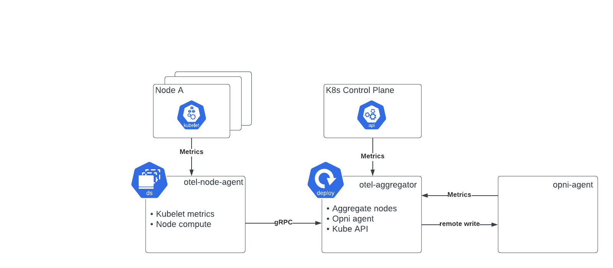

# Move to OTEL collector for metrics

## Summary

Currently Opni Metrics uses Prometheus running in agent mode to scrape metrics which are then remote written to the agent endpoint.  This enhancement will remove Prometheus in agent mode, and replace it with a deployment of the otel-collector.

### Related Issues

[#956 Prometheus memory utilization in downstream cluster](https://github.com/rancher/opni/issues/956)

## Use case
Opni Monitoring should be able to run in a wide array of setups, including edge configurations.  To enable this the footprint needs to be as small as possible.  Currently Prometheus uses > 1GB of RAM, even when running in agent mode.  This coupled with the ~500mb of RAM the agent uses, along with the Prometheus operator results in a larger than desired footprint.

[OpenTelemetry](https://opentelemetry.io) (or OTEL) is a vendor neutral opensource collection of tools, APIs, and SDKs.  Opni as a project has decided to align with OpenTelemetry

The OpenTelemetry Collector is a collector for metrics/traces/logs maintained by the OTEL group.  From the [repo](https://github.com/open-telemetry/opentelemetry-collector)
> The OpenTelemetry Collector offers a vendor-agnostic implementation on how to receive, process and export telemetry data. In addition, it removes the need to run, operate and maintain multiple agents/collectors in order to support open-source telemetry data formats (e.g. Jaeger, Prometheus, etc.) to multiple open-source or commercial back-ends.

To more tightly align with the Open Telemetry ecosystem and reduce the memory footprint of Opni, we should switch to using the OTEL Collector rather than Prometheus

## Benefits
 * Memory footprint become significantly smaller (~30mb for aggregator, ~40mb per node pod)
 * Tighter alignment with OpenTelemetry as a whole.
 * In the future can use the same agents for logging and tracing.

## Impact 
 * Metrics names and labels change from current Prometheus ones.  This will impact migrations; we may need to look at a relabeling process.
 * Will need to maintain a controller for generating otel configs.  Users can't just use standard prometheus operator serviceMonitor objects.

 ### End user impact
 Due to the change in the metric naming users may need to update any custom alerts they have.
 Data naming will be different in the new dashboards so after upgrade users will not see historical data in Dashboards.
 Users will need to swap any Prometheus Operator ServiceMonitors to the new custom resource that replaces those.

 Both of these may be mitigated by renaming the metrics, however this has not been investigated and is out of scope for this proposal.

## Implementation details
A controller will be deployed along with the agent to manage the OTEL Collector install.  This will be analogous to the current Prometheus operator.

There will be two components to the OTEL system:
1) The node agent.  This is responsible for collecting host level metrics from the kubernetes node, along with the local kubelet metrics.
1) The central aggregator.  This receives metrics from node agents and sends them to the the remote write endpoint, as well as scraping centralized metrics such as the opni agent metrics, and the kube-api data.

The Opni Agent will continue to be responsible for proxying remote-write data to Cortex, as well as managing the local configuration of the monitoring system for the cluster

### Test plan
Unit testing - full unit tests for the new controllers.  This should follow the existing controller test styles.
E2E testing:
1) Deploy Opni and install monitoring backend
1) Enable monitoring capbaility
1) Confirm OTEL pods are deployed successfully and no errors
1) Check Opni Agent logs to confirm remote write data is being sent
1) Review Dashboards to confirm all data is available

## Acceptance criteria.
1) Controller will deploy OTEL Collector infra structure when the appropriate custom resource is created.
1) Deployed OTEL Collector collects and ships all existing metrics provided by Prometheus (or equivalent) to Cortex
1) Existing dashboards display all data collected.
1) OTEL Collector Infra is created instead of Prometheus when monitoring capability is enabled for a cluster.
1) Users can collect custom metrics by creating a ServiceMonitor resource that mimics the Prometheus Operator ServiceMonitor.

## Supporting Documents

[Architecture Diagram](https://lucid.app/documents/view/7e8dfb6b-9f09-42db-8e7a-fa860b18cba5)

## Risks and contingencies
| **Risk** | **Contingency** |
|---|---|
| OTEL collector may not be able to collect a metric we need in the format we require | The OTEL architecture makes use of plugins so we will create our own ingester or processor to collect/transform the data required|

## Level of effort
3 developer weeks.